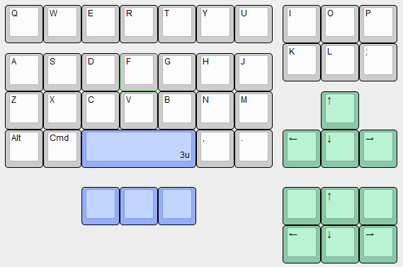

# Ortho 4x10 TKL
 
An open-source custom mechanical keyboard featuring
* 4x10 ortholinear 'tenkeyless' style layout
* Raspberry PI RP2040 integrated microcontroller
* USB-C
* Hotswap sockets
* Fully factory-assembled PCBA

### Photo

todo

### Layout

### PCB

Version 0.1.0 - First PCBA ordered from JLCPCB, it works!

### Firmware

todo

### Case

todo

## Thanks to

For excellent custom keyboard and PCB tutorials: [Noah Kiser](https://www.youtube.com/@noahkiser), [Joe Scotto](https://www.youtube.com/@joe_scotto)

For layout inspiration: Zicodia ("LMAO"), tominabox1 and whydobearsxplod ("QAZ"), Jack Humbert ("Planck")

## Disclaimer

**Offered without warranty or liability! Use/modify/order at your own risk.**

This is my first PCB and for a first attempt it turned out pretty good, but it definitely isn't perfect or thoroughly tested yet.

No customer support, but simple questions/suggestions/improvements may be considered.

If you want to know _how_ or _why_ I did something (especially PCB related) tutorials online can explain it better than I can, so I suggest looking elsewhere.